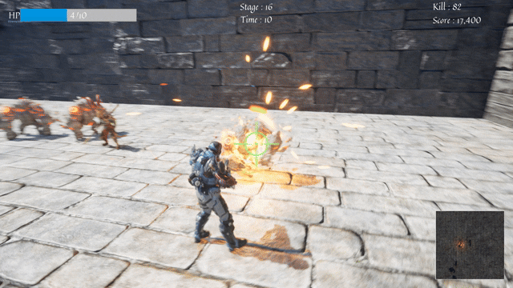

# TPS Wave Defense (UE5)

**Unreal Engine 5 기반 TPS 웨이브 디펜스 게임**  
미래의 군인이 중세 던전에 떨어져 끝없이 몰려오는 적을 상대하는  
아케이드 감성의 Wave Defense 게임입니다.

---

## 프로젝트 개요
- **장르**: TPS / Wave Defense  
- **엔진**: Unreal Engine 5  
- **개발 방식**: C++ + Blueprint 혼합  

---

## 개발 의도
본 프로젝트는 웨이브 기반 TPS 게임을 아케이드 감성으로 구현한 작품입니다.  
짧은 플레이 타임 안에서도 웨이브의 시작과 종료, 그리고 게임 오버로 이어지는  
명확한 게임 흐름이 느껴지도록 설계했습니다.

웨이브가 진행될수록 플레이어가 느끼는 압박감이 점진적으로 증가하도록  
난이도 곡선과 시각·청각적 피드백 요소를 조합했으며,  
몰려오는 적을 상대로 끝까지 버텨낸다는 감각이 분명히 전달되는  
TPS 경험을 목표로 개발했습니다.

---

## 배운 점
- 게임 루프(웨이브 시작 → 전투 → 종료 → 게임 오버)가 플레이 경험에 미치는 영향
- 상태 중심 설계를 통해 UI, 사운드, 적 스폰 시스템이 유기적으로 연동되는 구조의 중요성
- DataAsset 기반 구조를 통한 확장성과 유지보수성 확보
- 수치상 난이도보다 실제 플레이 체감 난이도가 더 중요하다는 점
- 사운드와 연출이 동일한 로직에서도 몰입도를 크게 좌우한다는 경험

---

## 기술 포인트

### 1️) 아키텍처 / 설계
- Wave 흐름을 관리하는 시스템과 개별 기능 시스템을 분리한 구조
- 웨이브 시작 / 종료 / 게임 오버 등 상태 변화 중심 설계
- 상태 변화에 따라 UI, 사운드, 적 스폰 로직이 일관되게 반응하도록 구성

### 2️) Enemy 시스템
- 단일 Enemy 클래스 + DataAsset 기반 티어 구조 (Star1 ~ Star5)
- 외형 / 애니메이션 / 기본 스탯 / 난이도 배율 분리
- FSM 기반 AI (대기 / 이동 / 공격 / 죽음)
- Navigation System을 이용한 플레이어 추적
- 엘리트 적 등장 시 전용 사운드 피드백

### 3️) 난이도 & 밸런싱
- 웨이브 진행에 따른 적 티어 등장 비율 가중치 조정
- 엘리트 적 등장 시 이벤트성 피드백 제공
- 반복적인 플레이 테스트를 통한 체감 난이도 중심 수치 튜닝

### 4️) 플레이어 시스템
- 컴포넌트 기반 설계
- 이동 / 공격 / 애니메이션 컴포넌트 분리
- 플레이어 본체는 입력 처리와 게임 흐름 제어에 집중
- 사망 시 GameOver → UI / 사운드 연동

### 5️) UI / UX
- 전투 중 핵심 정보(Stage, Time, Score, Kill)만 표시
- GameOver UI에서 결과 요약 제공
- SaveGame 기반 랭킹 시스템 (Top10 정렬 + 현재 기록 강조)

### 6️) C++ / Blueprint 혼합 구조
- 핵심 게임 로직(Wave, Enemy, 난이도, GameOver)은 C++
- UI, 연출, 레이아웃은 Blueprint / UMG

---

## 애셋 출처
- **3D 애셋**: Epic Games Fab (공식 무료 애셋)
- **배경 음악**: AI 생성 BGM (Suno)
- **사운드 이펙트**: freesound.org
